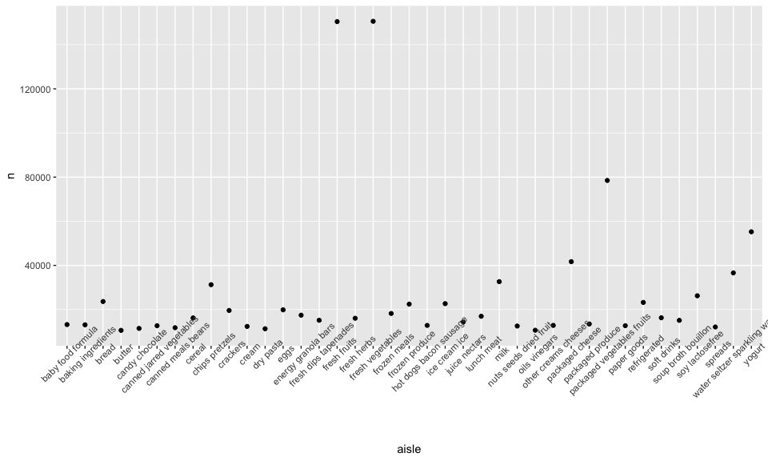

p8105\_hw3\_ng2696
================
Nihan Gencerliler
10/15/2019

# Homework 3

``` r
library (ggplot2)
library(tidyverse)
```

    ## ── Attaching packages ───────────────────────────────────────── tidyverse 1.2.1 ──

    ## ✔ tibble  2.1.3     ✔ purrr   0.3.2
    ## ✔ tidyr   1.0.0     ✔ dplyr   0.8.3
    ## ✔ readr   1.3.1     ✔ stringr 1.4.0
    ## ✔ tibble  2.1.3     ✔ forcats 0.4.0

    ## ── Conflicts ──────────────────────────────────────────── tidyverse_conflicts() ──
    ## ✖ dplyr::filter() masks stats::filter()
    ## ✖ dplyr::lag()    masks stats::lag()

``` r
library(patchwork)
```

## Problem 1

``` r
library(p8105.datasets)
data("instacart")
dim(instacart)
```

    ## [1] 1384617      15

``` r
head(instacart)
```

    ## # A tibble: 6 x 15
    ##   order_id product_id add_to_cart_ord… reordered user_id eval_set
    ##      <int>      <int>            <int>     <int>   <int> <chr>   
    ## 1        1      49302                1         1  112108 train   
    ## 2        1      11109                2         1  112108 train   
    ## 3        1      10246                3         0  112108 train   
    ## 4        1      49683                4         0  112108 train   
    ## 5        1      43633                5         1  112108 train   
    ## 6        1      13176                6         0  112108 train   
    ## # … with 9 more variables: order_number <int>, order_dow <int>,
    ## #   order_hour_of_day <int>, days_since_prior_order <int>,
    ## #   product_name <chr>, aisle_id <int>, department_id <int>, aisle <chr>,
    ## #   department <chr>

``` r
filter(instacart, order_id==1)
```

    ## # A tibble: 8 x 15
    ##   order_id product_id add_to_cart_ord… reordered user_id eval_set
    ##      <int>      <int>            <int>     <int>   <int> <chr>   
    ## 1        1      49302                1         1  112108 train   
    ## 2        1      11109                2         1  112108 train   
    ## 3        1      10246                3         0  112108 train   
    ## 4        1      49683                4         0  112108 train   
    ## 5        1      43633                5         1  112108 train   
    ## 6        1      13176                6         0  112108 train   
    ## 7        1      47209                7         0  112108 train   
    ## 8        1      22035                8         1  112108 train   
    ## # … with 9 more variables: order_number <int>, order_dow <int>,
    ## #   order_hour_of_day <int>, days_since_prior_order <int>,
    ## #   product_name <chr>, aisle_id <int>, department_id <int>, aisle <chr>,
    ## #   department <chr>

The “instacart” dataset includes 1384617 observations and 15 variables.
Some key variables are product\_name, order\_id, and user\_id. Each
observation appears to pertain to a product that was purchased by a user
as part of an order that includes other products, as well as information
about the order such as time of the order. For instance, there are eight
observations where order\_id=1, which leads us to conclude that this
order included eight products.

How many aisles are there, and which aisles are the most items ordered
from?

``` r
instacart_aisle=
instacart %>%
  group_by(aisle) %>%
  summarize (n=n()) %>%
  arrange(-n) 
  head(instacart_aisle)
```

    ## # A tibble: 6 x 2
    ##   aisle                              n
    ##   <chr>                          <int>
    ## 1 fresh vegetables              150609
    ## 2 fresh fruits                  150473
    ## 3 packaged vegetables fruits     78493
    ## 4 yogurt                         55240
    ## 5 packaged cheese                41699
    ## 6 water seltzer sparkling water  36617

There are 134 aisles in total and the most items are ordered from the
fresh vegetables and fresh fruits aisles, with 150609 and 150473 items
ordered respectively.

Plot that shows the number of items ordered in each aisle, limiting this
to aisles with more than 10000 items ordered:

``` r
instacart_aisle %>%
  filter(n>10000) %>%
  ggplot(aes(x=aisle,y=n)) + geom_point() + theme(axis.text.x= element_text(angle=45))
```

<!-- -->

Table showing the three most popular items in each of the aisles “baking
ingredients”, “dog food care”, and “packaged vegetables fruits”:

``` r
instacart_popular=
  instacart %>%
  filter(aisle %in% c("baking ingredients","dog food care","packaged vegetables fruits")) %>%
  group_by(product_name,aisle) %>%
  summarize(n=n()) %>%
  group_by(aisle) %>%
  mutate(aisle_ranking=min_rank(desc(n)))
instacart_popular %>%
  group_by(aisle,aisle_ranking,n) %>%
  filter(aisle_ranking<4)%>%
  arrange(aisle,aisle_ranking)%>%
knitr::kable()
```

| product\_name                                 | aisle                      |    n | aisle\_ranking |
| :-------------------------------------------- | :------------------------- | ---: | -------------: |
| Light Brown Sugar                             | baking ingredients         |  499 |              1 |
| Pure Baking Soda                              | baking ingredients         |  387 |              2 |
| Cane Sugar                                    | baking ingredients         |  336 |              3 |
| Snack Sticks Chicken & Rice Recipe Dog Treats | dog food care              |   30 |              1 |
| Organix Chicken & Brown Rice Recipe           | dog food care              |   28 |              2 |
| Small Dog Biscuits                            | dog food care              |   26 |              3 |
| Organic Baby Spinach                          | packaged vegetables fruits | 9784 |              1 |
| Organic Raspberries                           | packaged vegetables fruits | 5546 |              2 |
| Organic Blueberries                           | packaged vegetables fruits | 4966 |              3 |

Table showing the mean hour of the day at which Pink Lady Apples and
Coffee Ice Cream are ordered on each day of the week:

``` r
apples_coffee= 
  instacart %>%
  filter(product_name %in% c("Pink Lady Apples","Coffee Ice Cream")) %>%
  group_by(product_name,order_dow) %>%
    summarize(mean_order_hour=mean(order_hour_of_day)) %>%
    pivot_wider(names_from=order_dow,values_from =mean_order_hour)
knitr::kable(apples_coffee)
```

| product\_name    |        0 |        1 |        2 |        3 |        4 |        5 |        6 |
| :--------------- | -------: | -------: | -------: | -------: | -------: | -------: | -------: |
| Coffee Ice Cream | 13.77419 | 14.31579 | 15.38095 | 15.31818 | 15.21739 | 12.26316 | 13.83333 |
| Pink Lady Apples | 13.44118 | 11.36000 | 11.70213 | 14.25000 | 11.55172 | 12.78431 | 11.93750 |

## Problem 2

Load and clean data:

``` r
data("brfss_smart2010") 
brfss_smart2010=
brfss_smart2010 %>%
janitor::clean_names() %>%
  filter(topic=="Overall Health",response %in% c("Poor", "Fair", "Excellent", "Good","Very Good")) %>%
  mutate(response_ordered=factor(response, order = TRUE, levels =c("Poor", "Fair", "Good", "Very Good","Excellent")))
```

``` r
brfss_smart2010 %>%
  group_by(year,locationabbr) %>%
  summarize(n_sites=n_distinct(locationdesc)) %>%
  filter (year %in% c("2002","2010")) %>%
  pivot_wider(names_from=year,values_from=n_sites)
```

    ## # A tibble: 50 x 3
    ##    locationabbr `2002` `2010`
    ##    <chr>         <int>  <int>
    ##  1 AK                1     NA
    ##  2 AL                1      3
    ##  3 AR                1      3
    ##  4 AZ                2      3
    ##  5 CA                1     12
    ##  6 CO                4      7
    ##  7 CT                7      5
    ##  8 DC                1      1
    ##  9 DE                3      3
    ## 10 FL                7     41
    ## # … with 40 more rows

In 2002, PA, MA, BJ, CT, FL and NC had at least 7 sites In 2010, FL,NJ,
TX, CA, MD, NC, NE, WA, MA, NY, OH, CO, PA, and SC had at least 7 sites.

Average data\_value in each state over time:

``` r
brfss_smart2010 %>%
  filter(response=="Excellent") %>%
  group_by(locationabbr,year) %>%
  summarize(mean_value=mean(data_value)) %>%
  ggplot(aes(x=year,y=mean_value,color=locationabbr))+geom_line()
```

    ## Warning: Removed 3 rows containing missing values (geom_path).

<!-- -->

This plot indicates that, for a given year, there is a some variation in
the mean data value, with the mean data value in 2006 ranging from
around 15 to 27, for instance. There appears to be less variation across
time per state, as the lines are somewhat stacked on top of one another.

``` r
density_2006=
brfss_smart2010 %>%
  filter(year =="2006") %>%
  ggplot(aes(x = data_value, fill = response)) + 
  geom_density(alpha = .4, adjust = .5, color = "blue")

density_2010=
brfss_smart2010 %>%
  filter(year =="2010") %>%
  ggplot(aes(x = data_value, fill = response)) + 
  geom_density(alpha = .4, adjust = .5, color = "blue")

density_2006+density_2010
```

    ## Warning: Removed 3 rows containing non-finite values (stat_density).

    ## Warning: Removed 4 rows containing non-finite values (stat_density).

<!-- -->

The 2006 and 2010 density plots are very similar to one another. Each
response (“excellent”, “good” etc.) appears to be clustered around a
range of data values with some intersection. For instance, most
observations with response=fair have a mean data\_value of between 5 and
15.

## Problem 3

Tidied dataset:

``` r
accel_data=
  read_csv("./p8105_hw3_ng2696_files/accel_data.csv") %>%
  janitor::clean_names() %>%
  distinct() %>%
  pivot_longer(activity_1:activity_1440,
               names_to="minute",
               names_prefix="activity_",
               values_to="activity_count")%>%
  mutate(minute=as.integer(minute)) %>%
  mutate(day_type=ifelse(day %in% c("Monday", "Tuesday", "Wednesday", "Thursday", "Friday"), "weekday","weekend")) 
```

    ## Parsed with column specification:
    ## cols(
    ##   .default = col_double(),
    ##   day = col_character()
    ## )

    ## See spec(...) for full column specifications.

``` r
dim(accel_data)
```

    ## [1] 50400     6

``` r
head(accel_data)
```

    ## # A tibble: 6 x 6
    ##    week day_id day    minute activity_count day_type
    ##   <dbl>  <dbl> <chr>   <int>          <dbl> <chr>   
    ## 1     1      1 Friday      1           88.4 weekday 
    ## 2     1      1 Friday      2           82.2 weekday 
    ## 3     1      1 Friday      3           64.4 weekday 
    ## 4     1      1 Friday      4           70.0 weekday 
    ## 5     1      1 Friday      5           75.0 weekday 
    ## 6     1      1 Friday      6           66.3 weekday

There are 6 variables and 50400 observations in the resulting dataset,
with each observation representing a minute within a 5-week span. The
variables indicate the week, day, minute, day of the week, whether it’s
a weekend day or a weekday, and the activity count for that minute.

Total activity across days:

``` r
  accel_data %>%
  group_by(day_id,day) %>%
  summarize(daily_count=sum(activity_count)) %>%
  knitr::kable()
```

| day\_id | day       | daily\_count |
| ------: | :-------- | -----------: |
|       1 | Friday    |    480542.62 |
|       2 | Monday    |     78828.07 |
|       3 | Saturday  |    376254.00 |
|       4 | Sunday    |    631105.00 |
|       5 | Thursday  |    355923.64 |
|       6 | Tuesday   |    307094.24 |
|       7 | Wednesday |    340115.01 |
|       8 | Friday    |    568839.00 |
|       9 | Monday    |    295431.00 |
|      10 | Saturday  |    607175.00 |
|      11 | Sunday    |    422018.00 |
|      12 | Thursday  |    474048.00 |
|      13 | Tuesday   |    423245.00 |
|      14 | Wednesday |    440962.00 |
|      15 | Friday    |    467420.00 |
|      16 | Monday    |    685910.00 |
|      17 | Saturday  |    382928.00 |
|      18 | Sunday    |    467052.00 |
|      19 | Thursday  |    371230.00 |
|      20 | Tuesday   |    381507.00 |
|      21 | Wednesday |    468869.00 |
|      22 | Friday    |    154049.00 |
|      23 | Monday    |    409450.00 |
|      24 | Saturday  |      1440.00 |
|      25 | Sunday    |    260617.00 |
|      26 | Thursday  |    340291.00 |
|      27 | Tuesday   |    319568.00 |
|      28 | Wednesday |    434460.00 |
|      29 | Friday    |    620860.00 |
|      30 | Monday    |    389080.00 |
|      31 | Saturday  |      1440.00 |
|      32 | Sunday    |    138421.00 |
|      33 | Thursday  |    549658.00 |
|      34 | Tuesday   |    367824.00 |
|      35 | Wednesday |    445366.00 |

I don’t see any particular trends, besides that there are some days
where total activity count = 1440, which seems unlikely considering that
is the number of minutes per day. It’s possible that the accelerometer
was not working on these days, which both happen to be Saturdays.

Plot of activity count for each day:

``` r
accel_data %>%
  ggplot(aes(x=minute,y=activity_count,color=day))+geom_point()
```

<!-- -->

Based on this plot, there are some points during the day that have
unusually high activity, namely towards the end of the dat around minute
1300, particularly on Friday. Also, it appears that only on Saturdays
and Sundays does the person experience a high level of activity in the
middle of the day.
